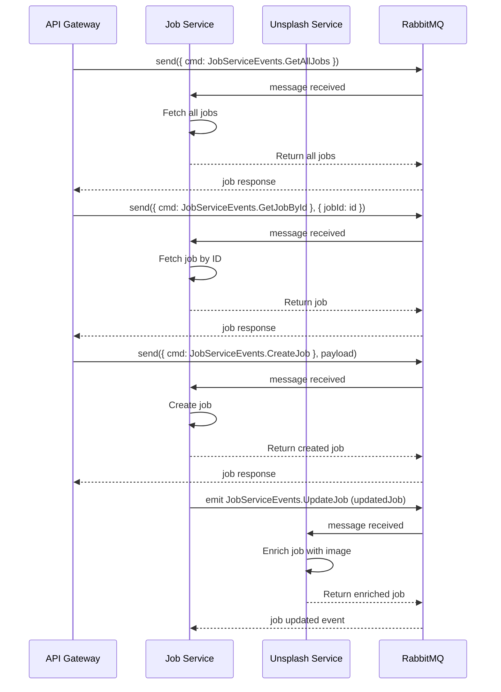

**

# Calo Jobs Microservice with Unsplash API
This full-stack application was developed to fulfill the test requirements and is designed to manage delayed job executions. The backend, implemented using NestJS, handles job creation and retrieval, while the React frontend provides a user-friendly interface for creating jobs and viewing their statuses or results. Each job simulates fetching random images from Unsplash's food category with varying execution times.

Since this repository contains only the backend code, the primary focus will be on the backend implementation.
## Table of Contents 
- [Quick Start](#quick-start)
- [Manual Start](#manual-starting-steps)
-  [Architecture](#architecture) 
 - [Code Overview](#code-overview)
## Quick Start

This application is fully dockerized and includes the following services:

- **API Gateway**: Acts as the entry point for client requests.
- **Job Microservice**: Manages job creation and status retrieval.
- **Unsplash Microservice**: Fetches random images from the Unsplash API.
- **RabbitMQ**: Handles messaging between the API Gateway and the microservices.

### Prerequisites

- Ensure Docker and Docker Compose are installed on your machine.

### Starting the Application

1. Clone this repository to your local machine:
    ```bash
    git clone https://github.com/imahmed18/calo-be.git
    cd <repository-directory>
    ```

2. Build and start the Docker containers using either `docker-compose` or `docker compose` depending on your 			   Docker version: 
	```bash 
	docker-compose up --build 
	``` 
	If you're using Docker version 20.10.0 or newer, use: 
	```bash 
	docker compose up --build 
	```
3. The application will start running and listening on port **3002**. You can access the API Gateway at:
    ```
    http://localhost:3002
    ```
## Manual Starting Steps

In case you want to manually start the services without Docker:

1. **Setup RabbitMQ**:
   - Ensure RabbitMQ is installed and running.
   - Configure the environment variables in your `.env` file based on your RabbitMQ credentials.

2. **Start the Job Microservice**:
   - Navigate to the root folder of the repository.
   - Run the following command to start the Job Microservice:
     ```bash
     npm run start:dev job-microservice
     ```

3. **Start the Unsplash Service**:
   - Open a new terminal.
   - Run the following command to start the Unsplash service:
     ```bash
     npm run start:dev unsplash-service
     ```

4. **Start the Main Application**:
   - Open another new terminal.
   - Run the following command to start the main application:
     ```bash
     npm run start:dev app
     ```
Once the services are running, you can access the API Gateway and other services as described earlier.

### Services and Ports

- **API Gateway**: `http://localhost:3002`
- **Swagger docs**: `http://localhost:3002/api`
- **RabbitMQ Management UI** (optional): `http://localhost:15672`

Once all services are up, you can start creating jobs and fetching random Unsplash images through the API.

---
## Architecture
This backend system is designed with a **microservices architecture** that follows the principles of **separation of concerns**, **scalability**, and **extendability**. Each microservice is responsible for a specific domain of functionality, which ensures that the application can scale independently and allows for easier maintenance and updates. The architecture leverages **synchronous and** **asynchronous communication** between the services, using **request response** (to exchange messages between services) and **event driven** (to publish events without waiting for a response).

### Design Consideration For Request-Response Message Pattern

The **request-response** communication pattern is used when **direct, synchronous communication** is required between microservices, usually for **critical operations** that need an immediate response. This pattern allows one service to send a request to another and wait for a response, ensuring that the communication is **deterministic** and **transactional**, which is essential for certain types of interactions, such as retrieving or updating data in real-time. Some key reasons for using request-response include:

1. **Real-Time Data Retrieval**: When a service needs to obtain specific information immediately, the request-response model is more suitable because it guarantees that the caller will receive a response within a set time. For example, when the **API Gateway** queries the **Job microservice** to retrieve job details, a synchronous response ensures that the client gets real-time data.
   
2. **Consistency and Reliability**: By using request-response, the architecture can ensure that any requested actions (e.g., creating, updating, or retrieving records) are processed immediately, providing consistent and predictable behavior. This is especially useful in situations where data integrity is crucial, such as creating a new job in the **Job microservice**.

3. **Error Handling**: Synchronous communication allows the system to handle errors in real-time. For example, if the **Job microservice** encounters an issue (e.g., job not found), it can immediately return an error response, which the **API Gateway** can handle gracefully, ensuring proper feedback to the client. Exception filters (such as **RpcException filters** -[ more details here](#1-synchronous-message-handling-with-rpc-to-http-exception-filter)) help map these RPC exceptions into appropriate HTTP responses.

4. **Transactional Operations**: Certain operations, such as creating a job and getting a confirmation back that it was successfully created, often require **strong consistency**. The request-response model allows for a **transactional workflow**, where the service can guarantee that the action has been completed before proceeding further.

---

### Design Consideration For Event-Based Message Pattern

An **event-driven architecture** complements request-response by introducing **asynchronous messaging**. This pattern allows services to communicate indirectly by publishing events and letting other services subscribe to and react to them. It enables a loosely coupled architecture where services can operate independently of each other and continue processing without waiting for a response. Some key reasons for using event-based communication include:

1. **Decoupling of Services**: Event-based communication decouples the services, meaning they don't need to know the specifics about each other to function. For example, when the **Job microservice** publishes an event such as `jobCreated`, the **Unsplash microservice** can asynchronously subscribe to it and act on it by fetching related images. This allows services to operate autonomously without being aware of the service’s internal details.
   
2. **Scalability and Resilience**: In an event-driven model, services can continue to work even if some dependent services are temporarily unavailable. The publishing service (e.g., **Job microservice**) does not need to wait for an immediate response, which means the system remains **resilient** and **scalable**. Events can be processed asynchronously and queued if needed, making the system highly responsive under heavy loads.

3. **Asynchronous Processing**: Certain actions, such as retrieving images from **Unsplash**, do not need to be processed synchronously. By publishing an event (e.g., `jobCreated`) when a new job is created, the system offloads the work to the **Unsplash microservice**, which can fetch the images in the background and update the job record when ready. This allows the **Job microservice** to continue handling new requests without being blocked.

4. **Eventual Consistency**: In scenarios where **eventual consistency** is acceptable (e.g., enriching jobs with images), the event-driven model allows services to achieve consistency over time without requiring real-time responses. This is useful when tasks are not time-sensitive but still need to be completed.

5. **Extensibility**: The event-driven architecture also makes it easy to add new features or services without modifying the existing ones. New microservices can subscribe to events like `jobCreated` or `jobUpdated` without changing the **Job microservice** or any other existing components. This promotes **scalability** and **extensibility** for future enhancements.

---
### All put together




This diagram provides a clear view of how messages flow between the services using RabbitMQ and demonstrates both the request-response and event-driven patterns in the architecture of this project.

---

### Partial Failures
In modern microservice architectures, applications often communicate with various services to perform tasks. This decentralized approach enhances flexibility and scalability but also introduces complexities related to error handling. One common challenge is managing partial failures, where some service calls succeed while others fail. To address this, effective strategies for partial failure handling have been integrated into the project, ensuring robustness and resilience.

1. **Synchronous Message Handling**
Synchronous message handling is critical for maintaining a clear communication channel between services. In this approach, requests are sent to a service, and the calling service waits for a response before proceeding. This method ensures that the caller has the most up-to-date information and can react accordingly.

	By incorporating error handling in synchronous calls, the application can gracefully manage failures. When a request fails, it is logged, and the error is communicated back to the client, allowing for appropriate error handling at the user interface level. This feedback is vital for maintaining user trust and understanding the application’s state.
2. **Timeout Management**
Timeout management plays a crucial role in ensuring that requests do not hang indefinitely. In distributed systems, network latency or service unavailability can lead to prolonged waiting times. Implementing a timeout allows the application to set a maximum wait period for a service response.

	If the timeout is reached, the application can throw a specific exception, signaling that the request could not be fulfilled within the expected timeframe. This proactive approach not only prevents the application from becoming unresponsive but also enables clients to take corrective actions, such as retrying the request or notifying users of an issue.
3. **Retry Mechanisms**
Retry mechanisms are essential for enhancing the resilience of service interactions. Transient failures, such as temporary network issues or brief service outages, can often be resolved by simply attempting the request again. By implementing a retry strategy, the application can automatically attempt failed requests a predetermined number of times before giving up.
	
	This mechanism is particularly beneficial in scenarios where occasional failures are expected. By logging retries and introducing delays between attempts, the application can reduce the load on services while increasing the likelihood of successful interactions. This not only improves the overall user experience but also helps maintain service availability during peak times or intermittent issues.
### Partial Failure Handling In Code
#### 1. Synchronous Message Handling with RPC to HTTP Exception Filter


**Understanding Synchronous Message Handling with RPC to HTTP Exception Filter**

#### 1. **Message-Based Communication**

In a message-based architecture, services communicate by sending messages (typically using a messaging protocol). In this context, the calling service (such as an API Gateway) sends a request to a microservice using RPC and awaits a response. If an error occurs during this process—such as a service being unavailable or a request failing due to validation errors—the response must convey this error effectively.

#### 2. **Why Use RPC Exceptions?**

When an error occurs in a service that communicates over RPC, simply throwing a standard error (like a generic `Error` or an `HttpException`) does not suffice for several reasons:

-   **Protocol-Specific Handling**: RPC errors need to be communicated in a way that aligns with the messaging protocol used. In most RPC implementations, there are specific error types that can be returned to the caller. By throwing an `RPCException`, we ensure that the error is serialized appropriately and includes necessary metadata (like error codes or additional context) that is relevant to the RPC communication.
    
-   **Client Expectation Management**: The client (in this case, the API Gateway) expects to receive a structured response that includes information about the error. Using an `RPCException` allows the microservice to provide a consistent error response format, ensuring the client can interpret and handle it properly.
    
-   **Decoupling Services**: By using an `RPCException`, services remain decoupled from HTTP-specific error handling. This abstraction allows the microservices to focus on their core logic while still enabling effective error communication.
    

#### 3. **Conversion to HTTP Exception at API Gateway**

Once an `RPCException` is thrown, it is caught and processed at the API Gateway level using an exception filter. This filter is responsible for converting the RPC exception into an appropriate HTTP exception that the client (browser in this case) can understand. Here’s how this conversion works:

-   **Error Mapping**: The exception filter examines the properties of the `RPCException` (like the error code or message) and maps them to an appropriate HTTP status code (e.g., 404 for Not Found, 500 for Internal Server Error). This mapping is crucial as it informs the client of the nature of the error.
    
-   **Consistency in Error Responses**: The filter ensures that all errors, regardless of their origin (whether they stem from the API Gateway or any microservice), are formatted consistently. This consistency is important for client applications that rely on standardized error responses to handle failures.
    
-   **Preservation of Context**: The exception filter can also extract additional context from the `RPCException`, such as error details or stack traces, and include them in the HTTP response. This information can be invaluable for debugging and for providing more informative feedback to the client.

### 2. Timeout Management


#### 1. **Understanding Timeout in Message-Based Communication**

In a microservices architecture, when one service makes a synchronous request to another, the expectation is that a response will be returned within a reasonable time frame. However, network issues, service unavailability, or long processing times can lead to situations where a request takes longer than anticipated. Without an effective timeout management strategy, the calling service could hang indefinitely, leading to poor user experience and potential system instability.    

#### 2. **Implementation of Timeout Management**

In the project, timeout management is implemented through a dedicated function that sets a maximum wait period for a service response. This is typically done using observable streams that allow for reactive programming patterns. Here’s how this is structured:

-   **Setting a Timeout**: When a request is made, a timeout is established to specify how long the application will wait for a response. If the response is not received within this timeframe, the application will throw a specific timeout exception. This can be implemented using operators like `timeout()` in RxJS, which provides a declarative way to manage timeouts within observables.
    
-   **Error Handling**: If a timeout occurs, the application can throw a specific exception (e.g., `RequestTimeoutException`). This exception serves as a clear signal that the request has failed due to a timeout rather than other types of errors. This distinction is important for clients that need to understand the nature of the failure.
    
-   **Client Notification**: Once the timeout exception is thrown, it can be caught and handled appropriately at the client level. The client can display a user-friendly error message or trigger a retry mechanism, ensuring that users are informed of the issue and can take corrective actions.
    

#### 3. **Integration with Overall Error Handling Strategy**

Timeout management integrates seamlessly with the broader error handling strategy employed in the microservices architecture. By combining timeouts with other mechanisms such as retries and logging, the application can provide a more robust response to failures:

-   **Retry Logic**: In cases of timeouts, the application can implement a retry strategy that attempts to resend the request after a timeout occurs. This can help mitigate transient issues and improve overall service availability.
    
-   **Logging and Monitoring**: Timeouts can be logged for monitoring purposes, allowing teams to analyze patterns over time. This data can be invaluable for identifying systemic issues within services and improving performance.

---

## Code Overview

### 1. Folder Structure

This project follows a modular microservice architecture designed to separate concerns and allow scalability and maintainability. Below is a detailed explanation of the folder structure:

### `/apps`
The `apps` folder contains all the core microservices and the API gateway, with each service encapsulated in its own folder. This separation promotes loose coupling and independent deployment.

#### `/apps/app`
This is the **API Gateway**, which orchestrates communication between the client and the microservices. It provides a unified interface for the services.

- **`/apps/app/src`**: The core source code for the API gateway.
  - **`/common`**: Contains shared utilities, services, or modules utilized across multiple parts of the gateway to reduce duplication.
  - **`/job`**: This module acts as an interface for the Job microservice. It defines the routes, controllers, and services that allow the gateway to interact with the Job microservice.
  - **`app.module.ts`**: This is the root module of the gateway, which imports and configures all sub-modules, such as `job`, to enable service communication.
  - **`main.ts`**: The entry point that bootstraps and starts the gateway application.

#### `/apps/job-service`
The **Job Microservice** handles all operations related to job management. This is an independent microservice that communicates with the API gateway and potentially other services.

- **`/src`**: Contains the service's source code.
  - **`job-service.controller.ts`**: Defines the routes and handlers for job-related requests.
  - **`job-service.service.ts`**: Contains the business logic for processing jobs and interacting with any job-related data.
  - **`job-service.module.ts`**: The module that registers the controllers and services for this microservice.
  - **`main.ts`**: Initializes the Job microservice, setting up the application's entry point.

#### `/apps/unsplash-service`
The **Unsplash Microservice** handles requests related to the Unsplash API or image management. Like the Job service, it operates independently.

- **`/src`**: Source code for the Unsplash microservice.
  - **`unsplash-service.controller.ts`**: Handles requests for Unsplash API interactions, routing them to the appropriate handlers.
  - **`unsplash-service.service.ts`**: Contains business logic related to the Unsplash API, such as fetching or managing images.
  - **`unsplash-service.module.ts`**: Registers the necessary services and controllers.
  - **`main.ts`**: Bootstraps the Unsplash service, acting as the microservice’s entry point.

### `/libs/shared`
The `libs/shared` directory is designed for reusability across multiple services, holding shared code that can be imported into various microservices or the API gateway.

- **`/dtos`**: Houses Data Transfer Objects (DTOs) that define the structure of data exchanged between layers and services.
- **`/enums`**: Contains shared enum definitions, promoting consistency when using values like statuses or types across the entire system.
- **`/models`**: Defines models and schemas used across the services, ensuring consistent data representation throughout the microservices.

### Additional Components
- **`Dockerfile`**: Each service has its own Dockerfile for containerization, enabling isolated environments for running each microservice independently.
- **`tsconfig.app.json`**: Contains TypeScript configurations specific to the service, ensuring proper type-checking and compiling.

### Thought Process
- **Modularity**: Each microservice exists in its own directory, which ensures that each service can scale independently and avoids tight coupling between services.
- **Reusability**: Shared components like DTOs, enums, and models are centralized in the `/libs/shared` folder, ensuring that common code is not duplicated.
- **Autonomous Services**: Each microservice is fully self-contained, with its own `main.ts` and `Dockerfile`, enabling independent build and deployment pipelines.
- **Scalability**: The structure is designed to accommodate additional microservices easily. New services can be added under `/apps`, ensuring the system remains scalable and flexible for future growth.

This modular and scalable folder structure lays the foundation for developing, deploying, and maintaining the project in a microservices architecture.


**
